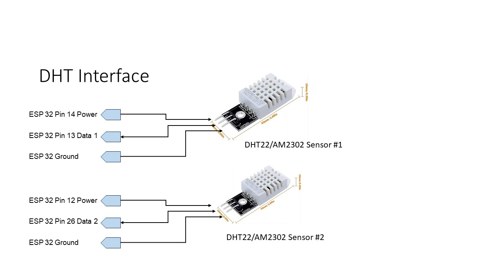

# DHT22/AM2302

The Digital Humidity and Temperature (DHT)  Sensor Module is compact and easy to use module.

## Features:

- Main Chip: AOSONG AM2302 High Sensitive Temperature Humidity Sensor
- Single-bus digital signal output, bidirectional serial data
- Temperature range: -40 to 80 degree celsius, 
- Temperature measurement accuracy: +/- 0.5℃ degree celsius
- Humidity measuring range: 0~100%RH, 
- Humidity measurement accuracy: ±2%RH

## Specifications

- Power supply 3.3-6V DC

- Sensing element Polymer capacitor

- Operating range humidity 0-100%RH; temperature -40~80 Celsius

- Accuracy humidity +-2%RH(Max +-5%RH); temperature <+-0.5 Celsius

- Resolution or sensitivity humidity 0.1%RH; temperature 0.1 Celsius

- Repeatability humidity +-1%RH; temperature +-0.2Celsius

- Humidity hysteresis +-0.3%RH

- Long-term Stability +-0.5%RH/year

- Sensing period Average: 2 seconds

## Schematic

The power to the DHT is from a GPIO pin.  This allows the software to reset the sensor 

## Software

I used the <dhtESP32-rmt.h> library.  This was the only library I could find that would not cause the VGA display to blink everytime the sensor was read.  The library is easy to use and provides good error information from the sensor.  When an error occurs I reset the sensors with the power control pin.  I read the temperature every 10 seconds.

I found that some of these sensors have a bias.  I use three commercial temperature sensors inside the freezer to determine the bias.  The software allows the user to enter the bias on each sensor.
