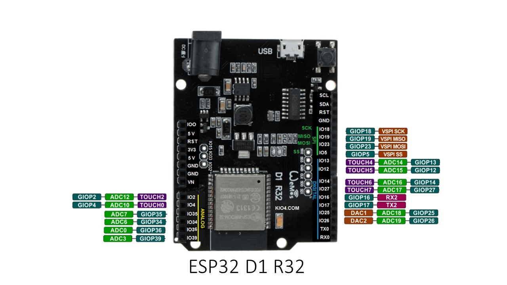

# ESP32 D1 R32

These boards are made by Wemos and HiLetgo.  They are older designs.  I would not recomend them for a new project the ESP32 development modules are much better.  I have also found that the Wi-Fi antenna is much better on the development modules.  I used this board because I have several lying around.

## **Description:**

The ESP32 D1 R32 is already integrated antenna and RF balun, power amplifier, low-noise amplifiers, filters, and power management module.  The entire solution takes up the least amount of printed circuit board area.  This board is used with dual-mode Wi-Fi and Bluetooth chips, which is safe, reliable, and scalable to a variety of applications.

## **Specification:**

- Standard UNO size and headers

- CPU and Memory: Xtensa® 32-bit LX6 Dua-core processor, up to 600 DMIPS

-  4 MByte SPI Flash

-  448 KByte ROM

-  520 KByte SRAM

-  Compact size of 68mm x 53mm x 3.1mm (±0.2mm)

-  Supply Voltage: DC 5V to 12V

## Comparison between ESP8266 and ESP32

