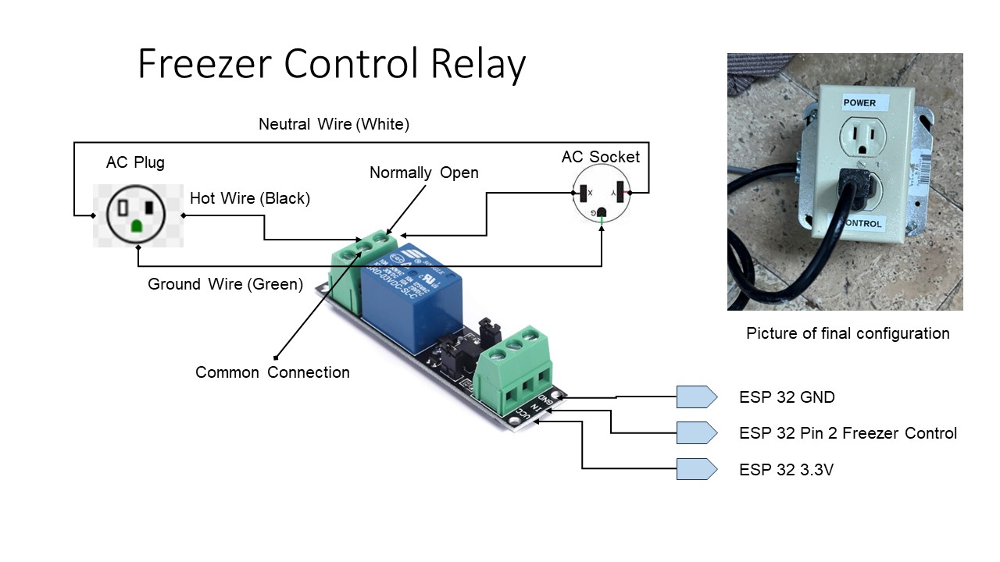

# Freezer Control Relay

The Freezer Control Relay is used to turn On/Off the freezer.  If you are using a refrigerator to store your kegs you do not this relay.

## Relay Specifications

The following are the specifications for the relay I selected.

30VDC 250VAC Load：The power switch is compatible with 10A 250VAC and 10A 30VDC load.

 Optocoupler Isolator:3V/3.3V power relay module supports photocoupler isolation control.

The freezer I use was an Insignia™ - 10.2 Cu. Ft. Chest Freezer.  The start up current is 21.4 amps and the On current is 2.0 amps.  The relay has handled the startup current fine.

## Schematic

The above schematic provides an overview of the connections. I included a
picture of my final product. I got the line cord off a food blender that was broken.
The line cord has 16-gauge wires.  The plug and the box were pieces I had laying around. The relay is enclosed inside the electrical box. The plug in the box goes to the freezer. I broke the power tab in the AC socket, so each socket is individual. I wired one socket to the relay normally open connection and the other to the relay normally closed connection.  When the freezer is on the power socket is off and when the freezer is off the power socket is on.
