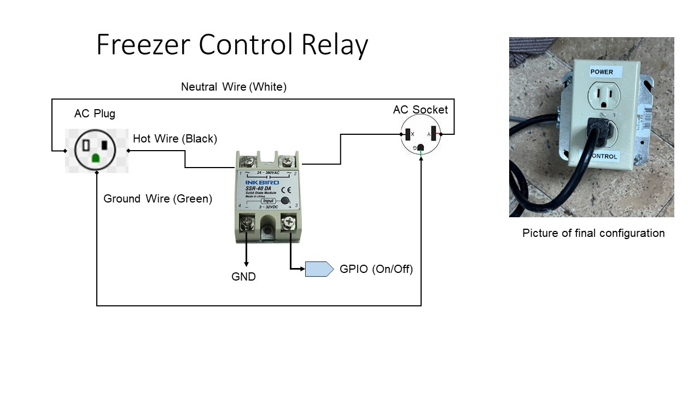
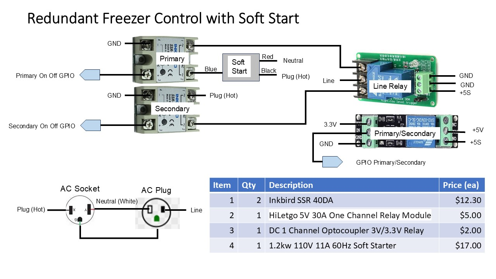

# Freezer Control Relay

The Freezer Control Relay is used to turn On/Off the freezer.

## **Relay Specifications**

The following are the specifications for the relay.

- Input: DC 3-32V;
- Output: AC 24-380V, 40 amps
- Number of switches: Infinite

The relay supports currents up to 40 amps and the relay activation works down to 3 volts.  A GPIO output can be used to drive the relay. The approximate current at 3.3 volts is 8.5 milliamps. The maximum drive current for an ESP32 GPIO is 40 ma, with 20 ma recommended maximum. So, this relay is a good, reliable choice. The SSR also has a resistance of about 3 ohms with a 3.3-volt drive that reduces the surge current.

The freezer I use was an Insignia™ - 10.2 Cu. Ft. Chest Freezer. The startup current is 21.4 amps and the on current is 2.0 amps. This relay has handled the startup current fine. 

Initially I used a small 10-amp relay. The relay failed in the "On" state after about 6 months which froze my beer.  I think because of the high inrush current.  A mechanical relay has a life expectancy of about 1 million activations. Under normal operation as a freezer controller the relay will last about 5 - 7 years. However, Solid State Relays (SSR) have an infinite number of switches. A SSR will not last forever, but it fails for reasons other than switching.I strongly recommend the SSR relay because it is more robust and more reliable. You may also consider the redundant relay that I talk about in the next section.

## **Schematic**

The above schematic provides an overview of the connections. I included a picture of my final product. I got the line cord off a food blender that was broken. The line cord has 16-gauge wires.  The plug and the box were pieces I had laying around. The relay is enclosed inside the electrical box. The plug in the box goes to the freezer.  

## **Redundant Relay Configuration**

### **Background**

SSRs can fail in either the open or closed position. Since I have about $500 worth of beer in my freezer, I wanted a redundant relay that would still work if the primary relay failed in either the open or closed position. the following describes my solution.

## **Overview**

The redundant relay concept is shown in the following figure:\

There are primary and secondary circuits in the design. When primary is on (LOW) no components are powered on when the freezer is Off.  When the Primary GPIO On/Off signal is HIGH the SSR switches on. The current drain is about 8.7 ma, which is about half of the  recommended maximum. The GPIO On/Off signal is HIGH about 25% of the time in the summer.

A switch to the secondary circuit occurs when the freezer temperature is below 32 degrees or above 40 degrees. Once switched to the secondary the only way to get back to primary is to reset the ESP32 board or enter a command.

The switch to Secondary only occurs when the GPIO On/Off signal is in the off position, so no AC current is flowing. When the GPIO Primary/Secondary signal goes HIGH, the Primary/Secondary relay activates the +5S signal which activates the Line Relay. The line relay now sends the AC power to the secondary SSR. When the secondary circuit is active the Secondary On/Off GPIO signal is used.  I wanted a relay with big contacts for the Line Relay and I could not find one that worked on 3.3 volts. The Primary/Secondary relay is included just to provide 5 volts to the Line Relay. You can eliminate the Primary/Secondary relay if you want to use a 10 amp relay.

The Secondary circuit is tested everytime I need to change a keg in the freezer or I clean the beer lines.  That way I know the Secondary circuit is good.  After the freezer gets back to the desired temperature, I switch back to Primary.  You can tell which circuit is active on the main display.  There is either a "P" or "S" next to the freezer status.

This diagram includes a soft start circuit to reduce the freezer on current.  It seemed to help some but I am not sure it is worth the extra cost and is another component that can fail.
