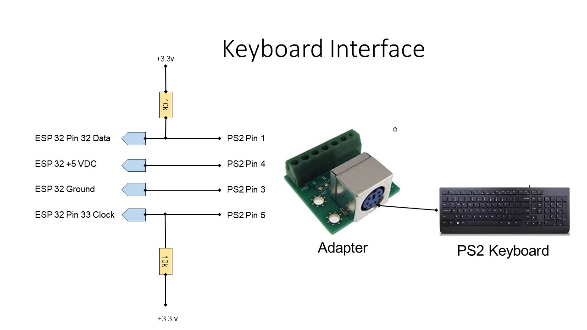

# Keyboard

I selected a PS2 keyboard for this project because they are very easy to
interface. You can normally find PS2 keyboards at garage sales and thrift
stores, but they are getting harder to find. You can tell it is a PS2 keyboard
by the distinctive round PS2 connector. For awhile they made PS2 compatible
keyboards with a USB connector, but unless the keyboard specifically says PS2
compatible it will not work. If you can't find a used PS2 keyboard, new ones
are available on Amazon for about 20 dollars.

## Keyboard Schematic

The PS2 keyboard requires 5 volts to operate and the ESP32 operates on
3.3 volts. So you need to make sure that the keyboard is wired to 5 volts and
the pullup resisters are connected to the 3.3 volt supply. The PS2 output is an
open collector interface.

PS2 breakout adapters like the one shown in the schematic are available,
but can be hard to find. There are USB to PS2 adapters readily available, so
you can use a USB breakout adapter instead.

I looked at using a USB keyboard, but you need a USB to TTL adapter, and
they were as much money as the PS2 keyboard.

## Software

For thie keyboard again I used the FabGL Graphics Library for ESP32. This library is great!  The library overview is at the following link [www.FabGL.com](http://www.fabgl.com/)  and is also available on Github. I used the default pin numbers for the keyboard from the library.
