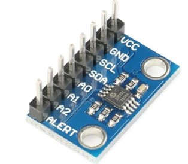
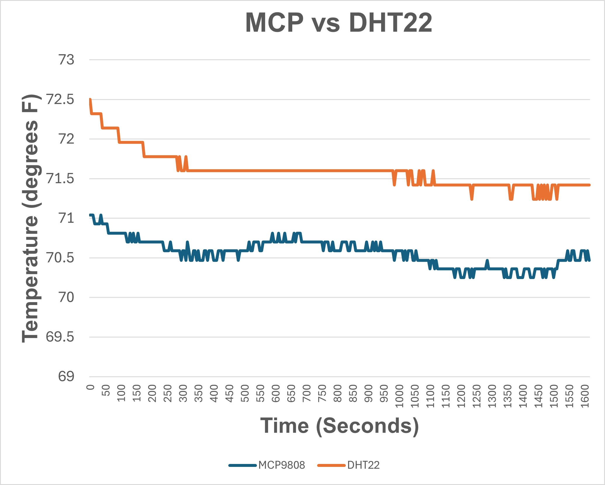
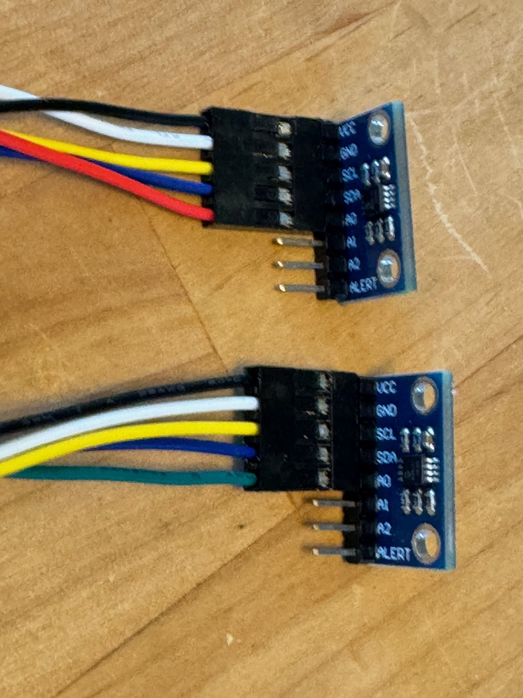

# MCP9808 Precision Temperature Sensor

This MCP9808 digital temperature sensor is low cost temperature sensor with a typical accuracy of ±0.25°C over the sensor's -40°C to +125°C range and precision of +0.0625°C.   It has a wide voltage range of 2.7  to 5.5 volts.  You can typically buy them for about 6 dollars.   The following is a picture of the typical device.  The device works on the I2C bus that is explained in the next section.

## I2C Bus

The I2C bus is a standard **bidirectional interface** that uses a controller, known as the master, to communicate with slave devices. A slave may not transmit data unless it has been addressed by the master. Each device on the I2C bus has a specific device address to differentiate between other devices that are on the same I2C bus.  The I2C bus can support 255 different addresses with a two wire interface.

All Arduino compaitible boards support the I2C bus.  The MCP9808 has 3 address pins so you can connect up to 8 on the I2C bus.  The base address 0x18.

The I2C bus is supported by the Arduino Wire library.

## Change from DHT22 to MCP9808

I decided to change from the DHT22 temperature sensor to the MCP9808 to get more accurate temperature readings.  I found that the DHT22 sensors had temperature biases upto 3 degrees and they seem to drift several degrees.    The following figure compares the MCP to the DHT22.

## Implementation

I ran five wires to each sensor (+3.3V, Gnd, SDA, SCL and A0).  On one sensor A0 was connected to 3.3V and the other sensor is connected to GND.  The addresses of the two sensors are hard wired to 0x18 and 0x19.  The following is a picture of the wired sensors.

The change from DHT22 to MCP9808 freed up two pins in the system.  There were two pins for each DHT22 (power and data) for 4 pins.  With the MCP9808, I only used 2 pins (SDA and SCL).  I am hoping I dont have to keep resetting the MCP9808 sensors like the DHT22 sensors.

Because the IC2 bus runs at a high rate (100 kHz)  the SDA and SCL wires should be kept to about a foot or less.  The other wires can be longer.
