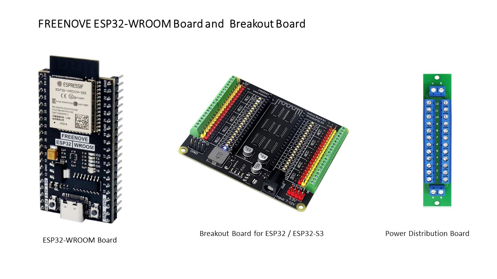
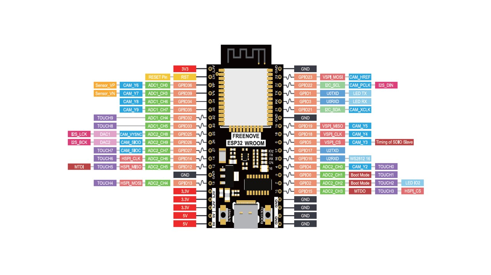

# **FREENOVE ESP32-WROOM Board**

For this project I selected the FREENOVE ESP32-WROOM developement board.  The main reason is the breakout board that is available for this board.  The breakout board is great.  I prefer to use a Arduino power supply instead of powering board from a type C USB connector.

## ESP32 Breakout Board

Breakout Board Features:

- •Compatible models -> Freenove ESP32 / ESP32-S3 series. (Note: Boards from other brands are not compatible due to different pinout.)

- •GPIO status LED -> LED on if GPIO outputs/inputs high level, LED off if GPIO
  outputs/inputs low level.

- •Independent LED -> The status LED is driven by the chip instead of the GPIO so the GPIO will not be affected.

- •Power circuit -> Provide multiple 5V and 3.3V power outputs. (5V output up to 3A
  with external power supply.)

- •Terminal block and header -> Connect to all GPIO headers 

## ESP32-WROOM

The ESP Development board has:

- 32 bit processor that runs at 240 MHz

- 4 MB Flash and 520 KB of SRAM running at 80 MHz

- Wi-Fi and Bluetooth Interfaces

- Onboard RGB LED and Green LED

- Onboard Code Uploader

The ESP32 includes

- 8 Analog-to-Digital Converter (ADC) channels

- 3 SPI interfaces

- 3 UART interfaces

- 2 I2C interfaces

- 16 PWM output channels

- 2 Digital-to-Analog Converters (DAC)

- 2 I2S interfaces

- 10 Capacitive sensing GPIOs

The ADC (analog to digital converter) and DAC (digital to analog converter) features are assigned to specific static pins. However, you can decide which pins are UART, I2C, SPI, PWM, etc – you just need to assign them in the code. This is possible due to the ESP32 chip’s multiplexing feature.

## Power Distribution Board

I use these boards for my 3.3 Volt power and ground distribution.  There are not enough pins the ESP32 for all the power and ground signals.  These little boards make distributing the power and ground very easy.

## FREENOVE ESP32 Pin Out

## Pin Utilization for Keg Monitor Project

| GPIO | I/O  | FreeNOVE                            | DEVKit V1                                                            |
| ---- | ---- | ----------------------------------- | -------------------------------------------------------------------- |
| 0    |      | Not  Recommended                 | outputs PWM  signal at boot, must be LOW to enter flashing mode   |
| 1    |      | Used for  development            | debug output  at boot, UART 0 Tx                                  |
| 2    | Out  | Freezer Power  Control           | connected to  on-board LED, must be left floating or LOW to flash |
| 3    |      | Used for  development            | High at boot,  UART 0 Rx                                          |
| 4    | Out  | VGA Blue0                           |                                                                      |
| 5    | Out  | VGA Blue1                           |                                                                      |
| 12   |      | Not  Recommended                 | boot fails if  pulled high                                        |
| 13   | Both | Temperature  Sensor 1            |                                                                      |
| 14   | Out  | Temperature  Sensor Power        | outputs PWM  signal at boot                                       |
| 15   | Out  | VGA V-Sync                          | outputs PWM  signal at boot                                       |
| 16   | In   | Serial from ESP32                   | UART 2 Rx                                                            |
| 17   | Out  | Serial to ESP32                     | UART 2 Tx                                                            |
| 18   | Out  | VGA Green0                          |                                                                      |
| 19   | Out  | VGA Green1                          |                                                                      |
| 21   | Out  | VGA Red0                            |                                                                      |
| 22   | Out  | VGA Red1                            |                                                                      |
| 23   | Out  | VGA H-Sync                          |                                                                      |
| 25   | Out  | Scale Clock                         |                                                                      |
| 26   | Both | Temperature  Sensor 2            |                                                                      |
| 27   | In   | ScaleOut4Pin                        |                                                                      |
| 32   | In   | Keyboard Data  PS2 pin 1         |                                                                      |
| 33   | Out  | Keyboard  Clock PS2 pin 5 USB D+ |                                                                      |
| 34   | In   | ScaleOut0Pin                        | Input Only                                                           |
| 35   | In   | ScaleOut1Pin                        | Input Only                                                           |
| 36   | In   | ScaleOut2Pin                        | VP Input Only                                                        |
| 39   | In   | ScaleOut3Pin                        | VN Input Only                                                        |
