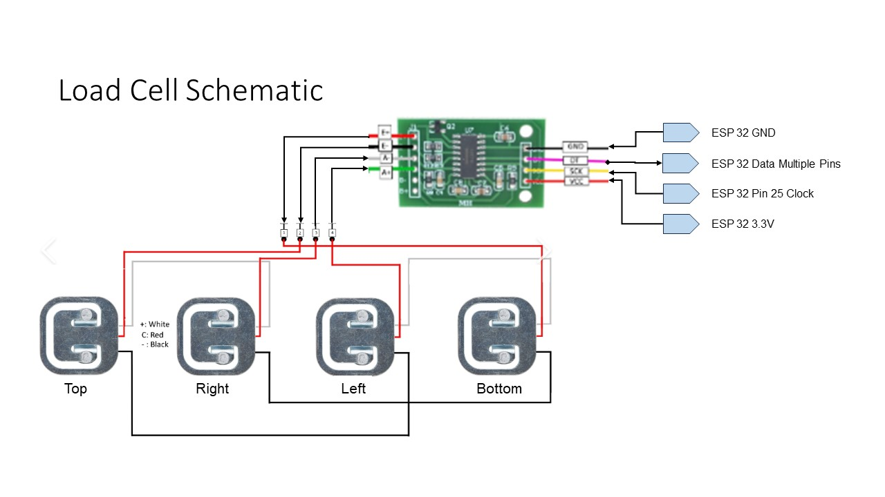
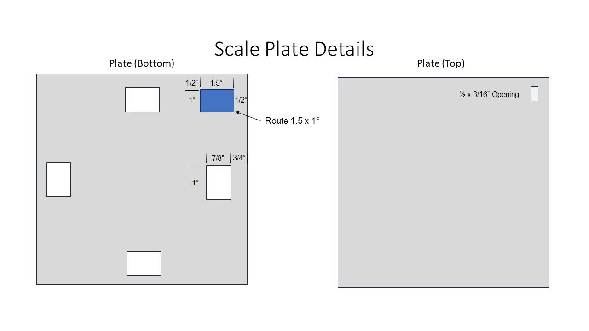
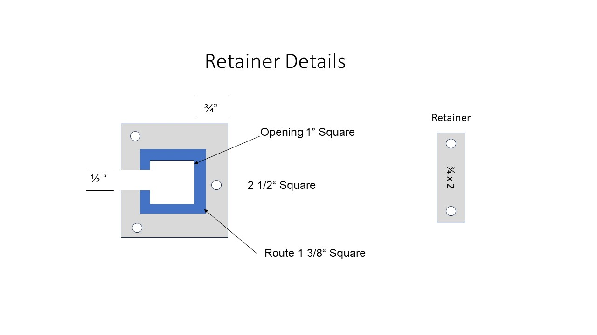
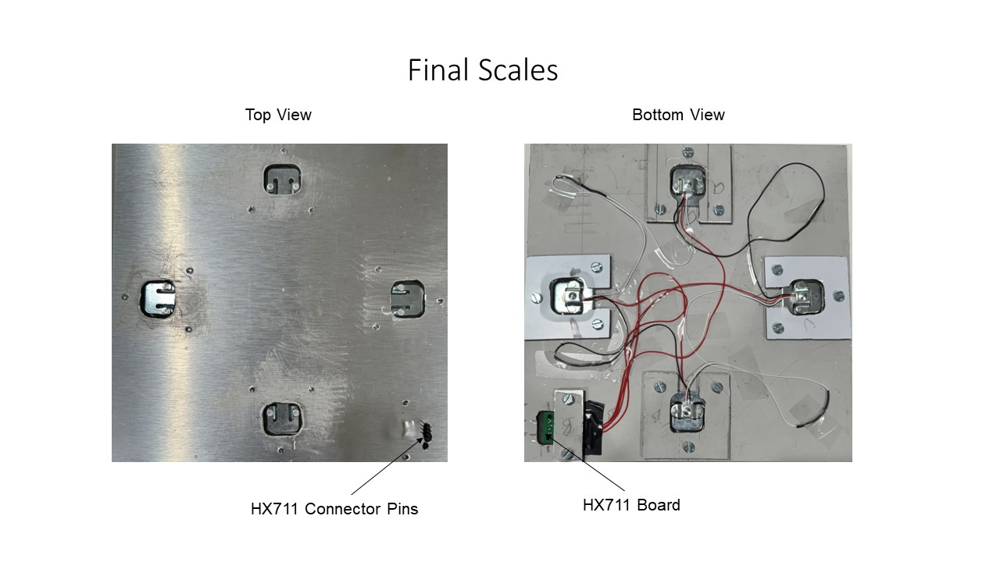
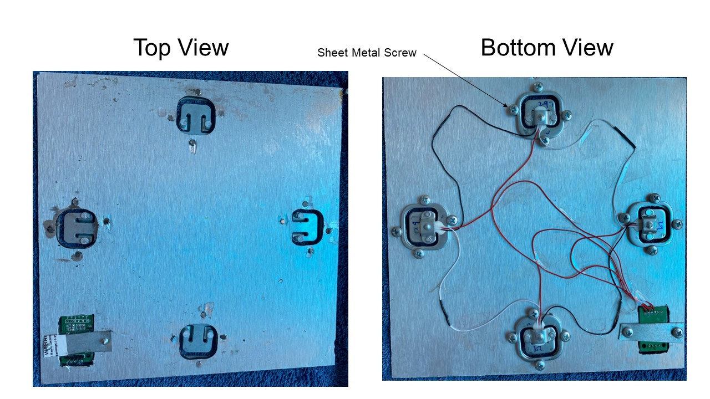
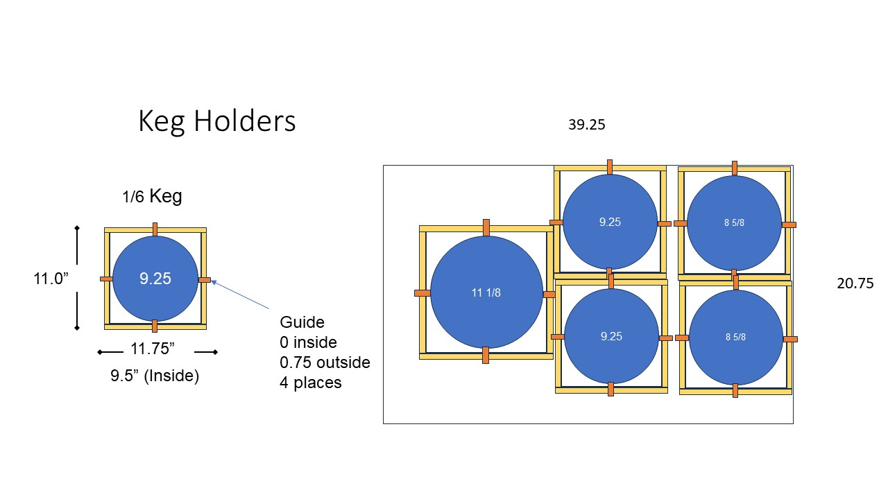

# Scales

For the scale plate I used Aluminum Composite Sign Panel sheet.  The sheets are 1/8 inch thick and come in a variety of sizes.  The most common is 12 inches by 24 inches.  You can use standard wood cutting tools to work with the plates.

I made two sizes of scale plates.  9.25 inches for Corny and 1/6 Barrel kegs. 12.125 for the Slim 1/4 Barrel.

## Schematic

The following is a schematic for one load cell:

The following is the Schmatic for multiple scales:

## Making the Scales

To make the scales, I used a table router and a table saw.  The following figure illustrates how to make the plates.  The plates size depends on which keg you plan to use.  The holes are for the strain gauge and on the center line of the plate.  I made them holes so you can align the strain gauge in the slot.  The route area is for the HX711 board.  You route out the area leaving a 1/16 inch top.  You cut a through area for the pins to go through the board.

They hold the strain gauges and HX711 boards in place I made some retainers out the scrap material.  On the strain gauge retainer, you route out an area and again leave 1/16 inch top material.  The retainer only keeps the strain gauge from moving.  All the keg weight is supported by the plate and the strain gauge.  I also made a little retainer to hole the HX711 board in place.  

To hold the retainers in place  I used 1/4-inch flat head machine screws.  I drilled and tapped the plate to hold the screws.  You can also use sheet metal screws, so you don't have to drill and tap. The following picture is the final product.  I just taped the wires to the plate on the bottom.

If you don't have a router table you can cut the holes in the plate and use sheet metal screws to hole the strain gauges and HX711 board.  The following figure is an example of this method.

## Keg Holder

I made keg holders for the kegs. The keg holders protect the HX711 connector from getting squashed and provide a hard surface for the strain gauge to sit on.  My freezer bottom was soft and strain gauge pressure point went right into the bottom.  The following figure illustrates the keg holder.

The keg holder uses 1x2 lumber for the frame with a hard plate on the
bottom. I used vinyl plank flooring on the bottom. It is completely waterproof,
has a nice rubber backing for the bottom and has a very hard surface. The
bottom is just nailed to the frame. The figure on the right shows my final 5
keg configuration.

I installed guides to help when I installed the keg. It turns out they
really don't help and are unnecessary.
