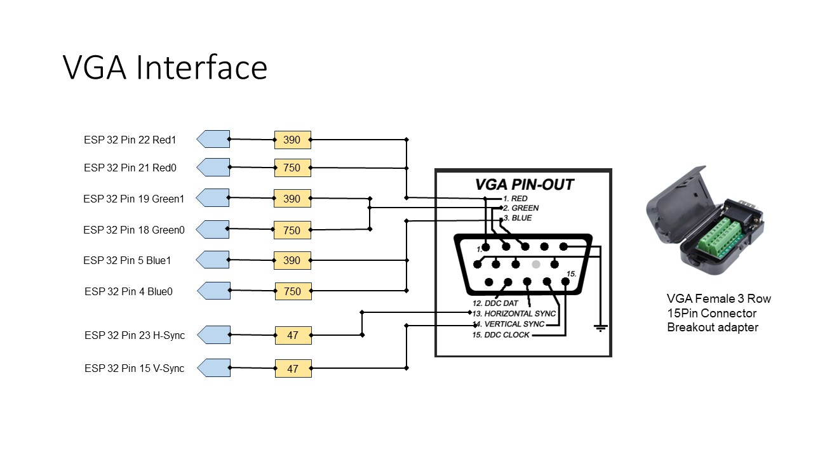
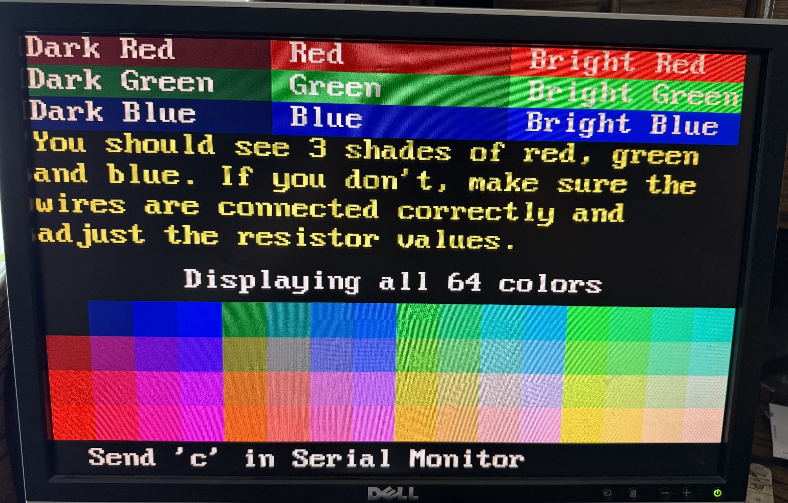

# VGA Interface

For this project I selected a VGA monitor for my local display. VGA monitors
are large and easy to read for my guests. They are also readily available and
cheap. I got mine free at a garage sale. They were closing up and the monitor
was still there, so they gave it to me. I also bought a VGA monitor at a thrift
store for 10 dollars.

## VGA Interface Schematic

The following is the schematic for the VGA interface:

The resistors for the RGB signals should have approximately a  2 to 1 ratio. The 47-ohm resistors are for impedance matching.

With this configuration you get 64 colors. 

## Software

For this project I used the FabGL Graphics Library for ESP32.  This library is great!  I used the same library for my keyboard interface.  The library overview is at the following link  [www.FabGL.com](http://www.fabgl.com/)  and is also available on Github.  I used the default pin numbers as defined in the library.

There is a **VGATest** program that displays all 64 colors and can help you test the VGA interface.  The following a sample of the test display showing all 64 colors.

