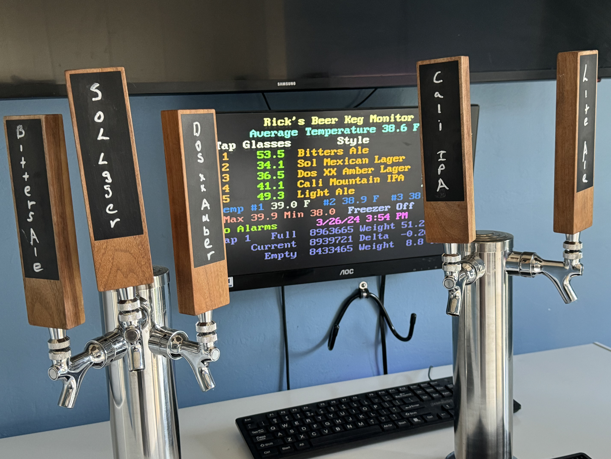

# Beer Keg Monitoring System

Build your own beer keg monitoring system that keeps track of how many
glasses of beer are left in each keg. The entire system costs less than
\$100 for 5 beer taps.

## Features:

- Tracks number of glasses of beer left.

- Controls Beer freezer temperature

- Monitors up to 8 beer taps.

- Temperature Stability +/- 0.75 degrees F

- Works with all DHT,  MCP9808 and/or DS18B20 Temperature Sensors

- - Up to 3 temperature sensors can be used.

- #NEW# Gets Time of day via WiFi and Network Time Protocol

- #NEW# Added CO2 Saver Support (See CO2 Saver Project)

- #NEW# Provides Redundant Power Supply Support

## Introduction

Currently there are two types of systems to measure how much beer is
left in the keg:

1) Flow measuring.

2) Weight of Keg.

Flow measuring systems are cheaper (6 taps about \$500) but they have
limited utility and you have to clean them every time you clean your
beer lines (every 6 weeks).

Weight of keg systems are none intrusive, but very expensive (\$1000 for
5 taps). They are not integrated with your entire system. This system
measures the weight of the keg but is low cost.

## Bill of Materials

The following is the bill of Materials for the entire system:

| Item | Qty | Description               | Price    | Total    |
| ---- | --- | ------------------------- | -------- | -------- |
| 1    | 5   | Scale Plate               | \$ 2.50  | \$ 12.50 |
| 2    | 5   | HX711 Load Cell Amplifier | \$ 2.00  | \$ 10.00 |
| 3    | 20  | Load Cell                 | \$ 0.80  | \$ 16.00 |
| 4    | 1   | PS2 Keyboard              | \$ 5.00  | \$ 5.00  |
| 5    | 1   | VGA Monitor               | \$ 10.00 | \$ 10.00 |
| 6    | 2   | DHT 22/AM2302 Sensor      | \$ 3.33  | \$ 6.67  |
| 7    | 1   | ESP32 Breakout Board      | \$ 13.00 | \$ 13.00 |
| 8    | 1   | ESP32 Development Board   | \$ 8.50  | \$ 8.50  |
| 9    | 1   | VGA Breakout Board        | \$ 7.50  | \$ 7.50  |
| 10   | 1   | PS2 Breakout Board        | \$ 4.00  | \$ 4.00  |
| 11   | 1   | Relay                     | \$ 2.00  | \$ 2.00  |
|      |     | Total                     |          | \$ 95.17 |

## Tools Required

- Soldering Iron (Amazon $10, Soldering Iron Kit - 9-in-1 With 5 Tips, Solder Wire)

- Connectors and Crimping Tool (Amazon $30, Kit with 1550PCS Male and Female 2.54mm Terminals)

- Multi Meter (Recommended Harbor Freight $7, 7-Function Digital Multimeter)

- Drill Motor

- Small Pliers, screw drivers

The following figure is a high level over of the whole project:

The data is displayed on the VGA monitor and input is via the keyboard.  A Solid State Relay (SSR) is used to control the freezer.  I replaced a standard relay with a SSR.  This relay is much more reliable and supports higher currents.  Upto  3 different temperature sensors can be used.  The time of day is received via Wi-Fi from an NTP Server.  A scale power relay is used to reduce false scale readings (discussed later).

## Theory of Operation

The theory of operation is quite simple. The data you need is:

1) Scale reading with nothing on the scale (Empty Scale Quanta)

2) Scale reading with a full keg of beer on the scale (Full Scale
   Quanta)

3) Scale reading of current keg (Current Scale Quanta)

4) Weight of a full keg (Full Keg Weight)

5) Weight of an empty keg (Empty Keg Weight)

The system automatically measures the first three items, all you need to
do is measure the full key weight and the empty keg weight. I just use a
bathroom scale.

Reading Per Ounce = (Full Scale Quanta – Empty Scale Quanta) / (Full Keg
Weight \* 16)

Current Ounces = (Current Scale Quanta – Empty Scale Quanta) / Reading
Per Ounce

Glasses = (Current Ounces – Empty Keg Weight) / 12 Ounces per glass

## Software

The software is in the software folder. 

## Hardware

Check out the hardware folders for all the intimate hardware details.

## Why a Keezer?

A Keezer is a chest **Freezer** converted to a **Kegerator** which is
commonly called a Keezer.

A Keezer has many advantages:

- They are more energy efficient.

- They have a lot of space for the cost.

- It is easy to access all the keg connectors.

- It is easy to install and remove the kegs.

Most freezers are not tall enough for the kegs with the fittings, so you
need to install a frame (collar) between the freezer top and the freezer
base. This is not very hard. You can find lots of articles on the
internet that describe how to do this.

The advantage of the collar is you do not have to drill through the wall
of the freezer to install taps, risking hitting a freezer coil. You can
also drill through the collar to bring in and out wires.

You should insulate the kegs from the bottom of the freezer to prevent
the beer from freezing and protect the bottom of the freezer. I used
padded vinyl plank flooring which worked great.

## Lessons Learned

1) Buy solid wire instead of stranded.  Much easier to work with.

2) Use an Ohm meter to check everything out.  It can save a lot of
   troubleshooting time. You can get one at Harbor Freight for just a
   few dollars. 

3) Buy the ESP32 Development Boards, instead of the UNO form factor
   boards (i.e. ESP32 D1 R32 or ESP8266 D1 R2).  Much easier to work
   with, better Wi-Fi, and faster.

4) If you need a lot of memory and pins use the ESP32-S3 development
   boards.

5) Use breakout boards with screw terminals, much easier and more
   reliable than the solder boards.

## HX711 Scale Sensor

I had a lot of trouble with the HX711 ADC sensor changing state. Periodically The scale reading would change to a completely different number and stay in this state. The readings were still very consistent in this false state. Powering the system On/Off would restore the HX711 ADC to the correct state.

I was able to determine the cause of this problem was power transients. I confirmed this by powering the scales from a battery for several days and no transients occurred.

To fix this problem a scale power relay was added. Every time the freezer is turned On/Off or the CO2 solenoid is turned On/Off the scales are powered off before the event. After the event the scales are powered back on. This finally solved the problem.

The other advantage of this solution is, if another source caused the power transient, the scales will eventually be turned Off/On and read the correct value.
