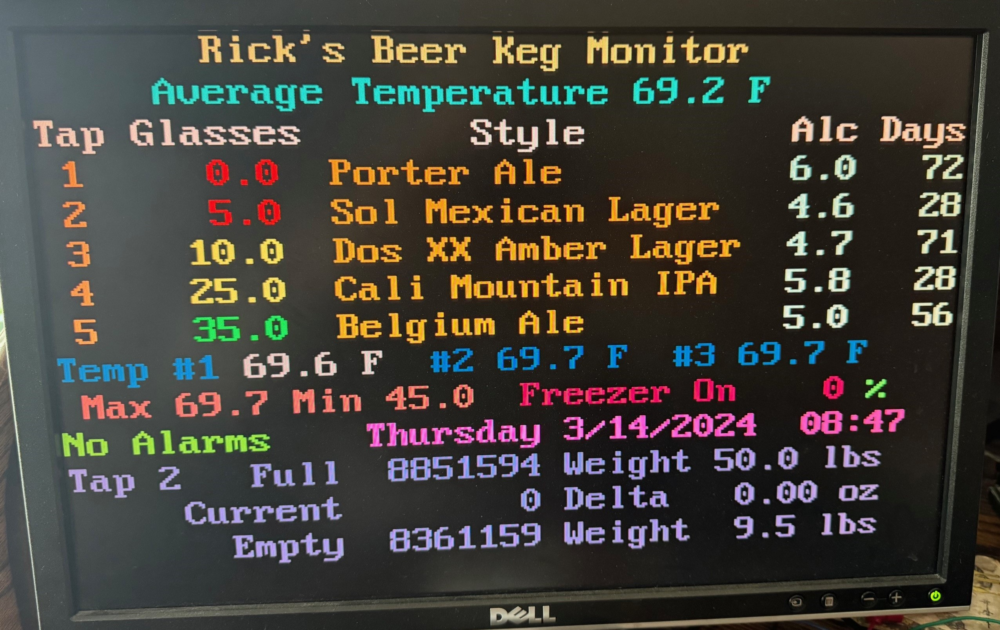
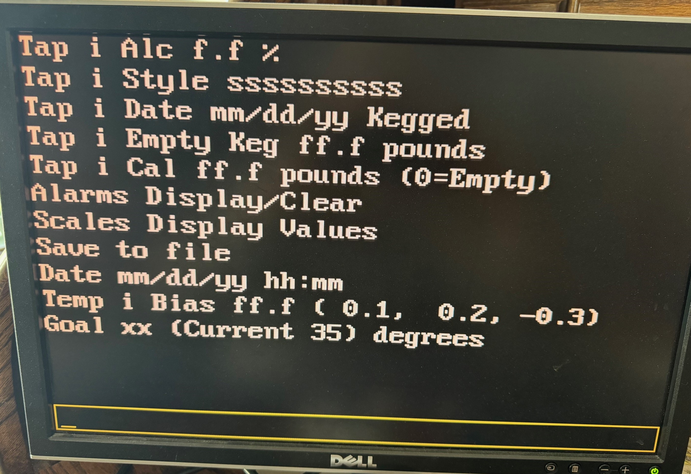

# Keg Monitor Program

The Keg monitor program controls the freezer temperature, measures how
many glasses of beer are available and provides a display with all your
beer information you need. 

The program also interfaces to a Wi-Fi board via a serial interface. 
You can use the program without this interface, but you will not be able
to send emails or text messages if something is wrong.  You can manually
input the time of day to get the number of days the beer has been
kegged.

The program display is a standard VGA display. I set the resolution to
40 characters by 15 lines, so it is easy to read from a distance.  The
following section describes the display.

# Main Display Overview

The first line is the Name of your system.  I called mine Rick’s Beer
Keg Monitor.

The second line is the average temperature.  This is the average of 180
samples or 30 minutes.

The third line is the titles for the columns.  The first column is the
Tap number, the second column is the number of glasses remaining, the
third column is the name and style of the beer, the fourth column is the
percentage of alcohol, and the last column is the number of days the keg
has been in freezer.  The Glasses column changes colors depending on how
many are left.  Less than 30 is yellow and less than 10 is red.

The 9th line is the current temperatures.  The highlighted temperature
is the sensor currently being used. 

The 10th line displays alarms and time of day.  If there are not any
alarms the display will show “No Alarms” in green.  If there are alarms
the display will show the number of alarms in red.  Next to the alarms
is the time of day.  If the Wi-Fi module is connected the time of day is
automatically displayed.   If the area is blank, you can manually input
the time of day.

The last three lines provide scale information.  The first line is Tap
number, the scale quanta value for a full keg and the weight of the keg
when it was full.  The next line shows the current quanta value and the
change in ounces between two consecutive readings.  If the scale is
working properly this should be a small number, unless you are pouring a
beer.  The last line shows the empty scale (nothing on the scale) quanta
value and the weight of an empty keg.

With the main display being displayed pressing a key will have the
following effect:

- Key a – Displays the current alarms.  Pressing the Esc key will clear
  the alarms and return you to the main display.

- Key 1-5 – Pressing a number key will display the information for the
  appropriate tap in the bottom three rows.  If you select the tap
  before you pour you can watch the ounces change.

- Key c – Clears the Minimum, Maximum and average temperatures.

- Key s – Opens the scale display window.

- Key Esc – Opens up the command menu.

## **Command Menu**

With this display you type the command to execute.  As you type, the
letters appear on the bottom of the display in the box.  You can hit
backspace to clear what you typed.  To exit this display hit the Esc
key.

The first four lines are for entering keg information.  Type the Tap
number and the information.  The information is alcohol percentage,
Style or name of beer, date the beer was kegged or installed in the
freezer and the weight of an empty keg.

The 5th line is for calibrating an empty keg and full keg.  If there is
not anything on the scale the main display should show the number of
glasses at about minus 13.  If not calibrate the scale with a weight of
0.  Put the full keg on the scale and enter the weight of the full keg
to calibrate.

The Alarms and Scales just bring up appropriate display.

Save to file, saves the current information to file.  Don’t forget to
Save when you have input information correctly.

Date is used to input the current date and time when you don’t have the
Wi-Fi board connected.

The “Temp i Bias” line is to input the bias on the temperature sensors. 
The line shows the current bias value.

The Goal is the temperature you want your freezer to be.  The DHT
sensors can have a bias.  I have had some sensors that had a bias up to
2 degrees.  Before you set the goal too low make sure the bias and
temperature are correct.  Freezing beer is BAD!  I found that 36 degrees
is safe, and the beer still tastes cold.  Refrigerators are normally 40
degrees.

## Software

The software is divided into files. The files contain functionally
similar functions.
