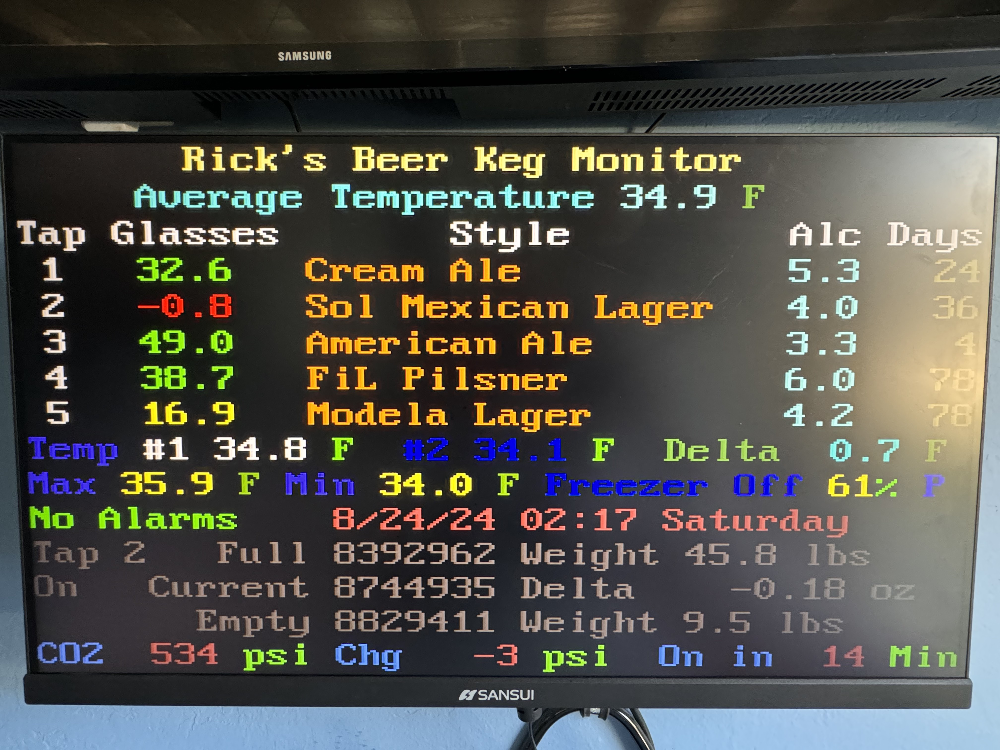
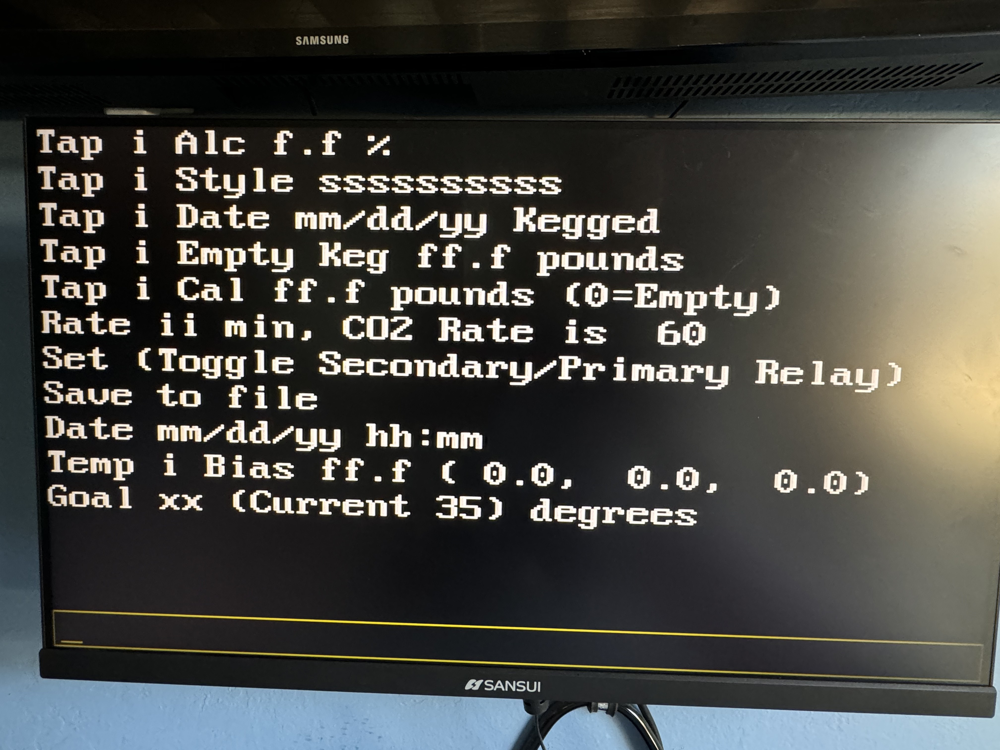
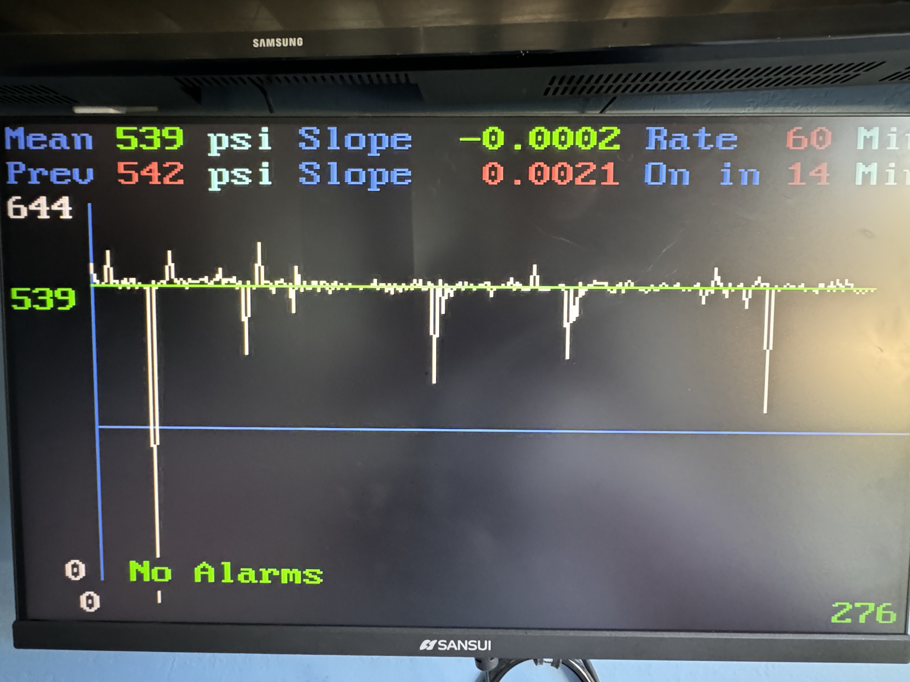

# Keg Monitor Program

The Keg monitor program controls the freezer temperature, measures how
many glasses of beer are available and provides a display with all the
beer information you need. 

The program runs on the FREENOVE ESP32-WROOM development board
(Keg_Monitor_RevX.X.ino). Arduino compile information is included on the
first line of the file.

The program also interfaces to a Wi-Fi board via a serial interface. 
You can use the program without this interface, but you will not be able
to send emails or text messages if something is wrong.  You can manually
input the time of day to get the number of days the beer has been
kegged.

The program display is a standard VGA display. I set the resolution to
40 characters by 15 lines, so it is easy to read from a distance.  The
following section describes the display.

# Main Display Overview

The first line is the Name of your system.  I called mine Rick’s Beer
Keg Monitor.

The second line is the average temperature.  This is the average of 180
samples or 30 minutes.

The third line is the titles for the columns.  The first column is the
Tap number, the second column is the number of glasses remaining, the
third column is the name and style of the beer, the fourth column is the
percentage of alcohol, and the last column is the number of days the keg
has been in freezer.  The Glasses column changes colors depending on how
many are left.  Less than 30 is yellow and less than 10 is red.

The 9th line is the current temperatures.  The highlighted temperature
is the sensor currently being used. 

The 10th line displays alarms and time of day.  If there are not any
alarms the display will show “No Alarms” in green.  If there are alarms
the display will show the number of alarms in red.  Next to the alarms
is the time of day.  If the Wi-Fi module is connected the time of day is
automatically displayed.   If the area is blank, you can manually input
the time of day.

The next three lines provide scale information.  The first line is Tap
number, the scale quanta value for a full keg and the weight of the keg
when it was full.  The next line shows the current quanta value and the
change in ounces between two consecutive readings.  If the scale is
working properly this should be a small number, unless you are pouring a
beer.  The last line shows the empty scale (nothing on the scale) quanta
value and the weight of an empty keg.

The last line is the CO2 status information. The first field is the
current CO2 pressure. The next field is the change in pressure during
the last hour. If the change is greater than 100 psi you may have a
leak. The last field is how many minutes before the CO2 valve turns on
agan.

With the main display being displayed pressing a key will have the
following effect:

- Key a – Displays the current alarms.  Pressing the Esc key will clear
  the alarms and return you to the main display.

- Key 1-5 – Pressing a number key will display the information for the
  appropriate tap in the bottom three rows.  If you select the tap
  before you pour you can watch the ounces change.

- Key c – Clears the Minimum, Maximum and average temperatures.

- Key s – Opens the scale display window.

- Key p – Opens the CO2 plot display window

- Key Esc – Opens up the command menu.

**Command Menu**

With this display you type the command to execute.  As you type, the
letters appear on the bottom of the display in the box.  You can hit
backspace to clear what you typed.  To exit this display hit the Esc
key.

The first five lines are for entering keg information.  Type the Tap
number and the information.  The information is alcohol percentage,
Style or name of beer, date the beer was kegged or installed in the
freezer and the weight of an empty keg.

The 5th line is for calibrating an empty keg and full keg.  If there is
not anything on the scale the main display should show the number of
glasses at about minus 13.  If not calibrate the scale with a weight of
0.  Put the full keg on the scale and enter the weight of the full keg
to calibrate.

The next line sets the CO2 valve rate. 0 turns it on continuously and 99
turns it off.

The nest line sets either the primary or secondary relay.

Save to file, saves the current information to file.  Don’t forget to
Save when you have input information correctly.

Date is used to input the current date and time when you don’t have the
Wi-Fi board connected.

The “Temp i Bias” line is to input the bias on the temperature sensors. 
The line shows the current bias value.

The Goal is the temperature you want your freezer to be.  The DHT
sensors can have a bias.  I have had some sensors that had a bias up to
2 degrees.  Before you set the goal too low make sure the bias and
temperature are correct.  Freezing beer is BAD!  I found that 36 degrees
is safe, and the beer still tastes nice and cold.  Refrigerators are
normally 40 degrees.

## CO2 Saver

When you press ‘p’ on the main display the following plot is displayed.

The top row shows the current average pressure, and the slope of the
line fit to the raw data. The Rate is the current on rate.

The next line is the previous mean and slope. The last field is when the
CO2 valve will turn on.

The rest of the display is the plot. The left is the X-axis in psi and
the bottom is the y-axis in number of samples. The green values and line
are the linear regression fit the raw data. The white is the raw data.

## Setup

All the setup is done by editing the “Constans.h” file. In my
configuration all the available GPIO pins are used. I use two MCP9808
temperature sensors that use the SCLpin and SDApin. If you want to use
different temperature sensors you need to change the pin numbers. So for
example, if you are using two DHT Type 2 sensors you need to change the
DHT1Pin to 13 and the DHT2pin to 14 and change SCLpin to -1 and SDApin
to -1. You have to keep all the pin names for the program to compile.

Another example, if you are not using the CO2 Saver, you set CO2Saver to
false. Now pin 0 and pin 35 are available to use, but you have to set
CO2ValvePin to -1 and CO2PressurePin to -1.

If you are using Wi-Fi to get time of day, you have to set ssid to the
name of your Wi-Fi network and password to the password of your network.
If you don’t live on the west coast you have to change the gmtOffset_sec
to your time zone.

## Software Files

The software is divided into files. The files contain functionally
similar functions.

### “Constants.h”

This file contains the temperature sensor configuration information,
GPIO pin assignments, color constants, alarm numbers and other global
constants. I made this a separate file to reduce clutter in the main
program. I think the comments in the file are self-explanatory. In my
final configuration, I did not have any pins left, so if you make
changes to the sensor configuration you have to change some of the pin
assignments.

If you have less than 5 taps, you can change the numscales variable to
the number of taps you have. If you have less than 4 taps you may want
to modify the display.

The 64 colors are also defined in this file. The color names are based
upon the RGB values for the color. I had to modify some of the names
because they were too long or conflicted with other constants.

## Keg Monitor

The Keg Monitor file is the main module. It has the libraries used with
an explanation for each one. There are two libraries that I wrote myself
included. \<HX711_Single_Clk.h\> and \<DHTSimple.h\>. These libraries
are available on my GitHub site. \<HX711_Single_Clk.h\> library drives
all the scales on a single clock reducing number of pins.
\<DHTSimple.h\> is a non-blocking DHT sensor reading library. Most
libraries block interrupts when reading the DHT sensor which causes the
display to flicker each time the sensor is read.

The main loop checks for input in Serial 0 (Serial Monitor interface),
Serial 2 the interface to the Wi-Fi board, the keyboard, and tasks. You
can type in commands on the Serial 0 interface. The tasks run every 3
seconds, 10 seconds, and every minute. The 3 second task only runs when
calibrating a keg. The 10 second task is for reading the freezer
temperature and reading the scale values. The 1-minute tasks are for
display update and sending data to the Wi-Fi board.

### Files

The files folder reads and writes the configuration information in a
file name config.txt. This file is in the “data” folder per the Arduino
standard. The configuration file must be uploaded to the ESP32 board for
the program to run. There are several places where you can find
instructions on setting up a file system and uploading files.
/<https://randomnerdtutorials.com/install-esp32-filesystem-uploader-arduino-ide/>.
I chose the LittleFS because it is small and reliable.

This file stores all the important information on your system. Open the
file to see this information. The file is only updated when you use the
Save command.

## Temperature

This file does all temperature sensor processing. It initializes the
sensors, reads the temperatures, adds the bias, checks the temperatures,
runs a moving average on the sensor being used and turns the freezer on
and off. The temperature checking depends upon the number of sensors
installed.

## Keyboard

The keyboard file processes the keys that are pressed. Depending on what
display is currently being shown, the keys are processed differently.

## Commands

The command file processes the input commands.

## Display

The display file processes the 4 displays. There are the Main Display,
Command Display, Alarms Display and Scales Display.

The alarm display shows the current active alarms. Exiting this display
clears all alarms.

The scales display is used to check and troubleshoot the keg scales.
There are two options: raw values and delta values. The raw values are
the quanta values currently being read. The values should be similar
from reading to reading. The delta values are the difference between two
readings.

## Scales

The scale file reads the scales, checks the read values, calibrates the
scales, calculates the number of glasses left in each keg and does the
time-of-day calculations. The only thing the time of day is used for is
to calculate the number of days the beer has been kegged.

## Wi-Fi

This file has the Wi-Fi initialization and Time of day functions

## CO2

This file has the CO2 functions to read the pressure transducer and
operate the solenoid valve.
