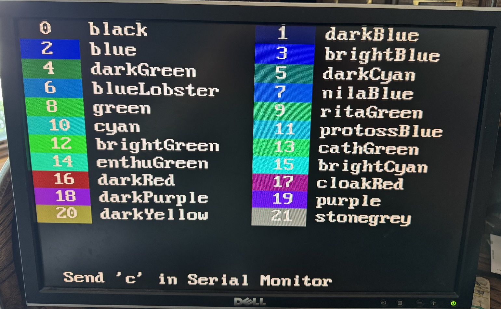
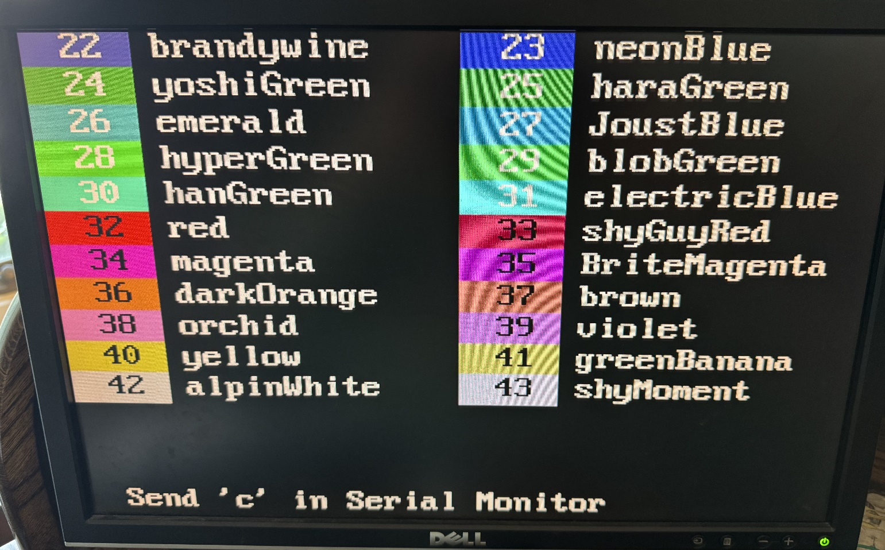

# VGA Test

This software will test the VGA interface. Every VGA monitor is a little
different so if you want the best colors, you can run this test to make
sure your hardware is set up optimally.

## Main Display

The following figure is a sample of the Main Display.

The picture is not great because of the video refresh rate. The top
three rows show the Red, Green, and Blue primary colors. The goal is to
have as much differentiation between the row of colors. If you can not
tell the difference between the left, middle and right color you need to
check your connection or change the resistor values. You can move the
outputs (i.e. Red1 and Red0) to a breakout board and switch in different
resistor values. I used 100-ohm resistors to get a good differentiation.
You can also use a potentiometer.

The bottom part of the display shows the possible 64 colors that can be
displayed.

Type in ‘c’ in the Serial Monitor and it will take you to another
display. The following is a sample of the display:

The display shows the first 21 colors. The color (with the number inside
the color) followed by the color name. You can use the number or the
name to select the color. The following two images show the displays as
type ‘c’ in the Serial Monitor.

You can scroll through the three displays to see all the colors, to
decide which ones you want to use.

