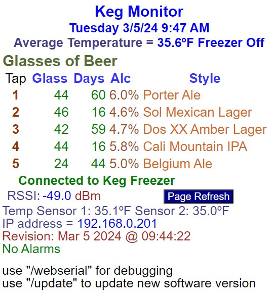

# Wi-Fi Display

## Overview

The following is a screen shot of the Wi-Fi display.

The first row is the title.  The second row is the current date and time.  The third row is the average temperature and if freezer is On or Off.  This information is received on the serial interface to the Keg Monitor.

The next section is the glasses of beer left, the number of days the keg has been in the beer freezer, alcohol percentage and the beer name and style of beer.  This is from Keg Monitor.

The next line displays whether the Keg Monitor is connected or not.  The RSSI is the signal level from the Wi-Fi network.

Since the Wi-Fi board is mounted up under an eave, I must get a ladder to get it down.  To avoid this I installed WebSerialLite for debugging and AsyncElegantOTA to upload software changes.

## Software

Libraries Used:

- TimeLib.h is used to get the network time of day. 

- WiFi.h is the WiFi connection library

- ESPmDNS is the Dynamic Name Service Library so I can type in a name instead of the IP address.  The name is KegMonitor.locol.

- ESPAsyncWebServer.h is the web server software.  You have to use the Async software for the WebSerial software.

- AsyncElegantOTA.h is used to upload software changes.

- KegMonitior.h is the HTML code.  The HTML code is stored in a const char array named indx_html[].  This code is copied to a dynamic memory array so variable information can be displayed.  The HTML code is compiled as part of the firmware, so I only have to upload one file.

- Passwords.h contains all the private information I use to connect to the network and eMail.  I made it a seperate file so I dont have to modifiy the code to upload it.

- AsyncTCP.h is required to support the ESPAsyncWebServer.

- ESP_Mail_Client is used to send emails and text messages when a problem is detected with the Keg freezer.  An eMail and a text message is sent when communication between the WiFi board and the Keg Monitor board is lost for one hour, the Freezer temperature is above 40 degrees F or the freezer temperature is below freezing.

- WebSerialLite.h acts just like the Arduino serial window that I use for debugging.
